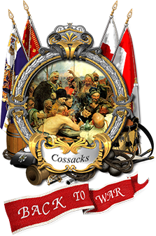

    

# Cossacks Community Edition

This project is an effort to migrate the classic game **Cossacks: Back to War** to modern systems. The goal is to refactor and update the original source code to ensure compatibility with contemporary hardware and software environments while preserving the original gameplay experience.

## Motivation

**Cossacks: Back to War** is the greatest RTS game ever made, in my opinion. However, the game is showing its age and is becoming increasingly difficult to run on modern systems. The goal of this project is to ensure that the game remains accessible to both old and new players alike.

## Roadmap

Done doesn't mean it's perfect, it just means it works.
The list is not exhaustive and will be updated as the project progresses.

| Description | Status | Comments |
|-------------|--------|----------|
| Migrate from DirectDraw to SDL | ✅ Done | There are some visual artifacts on some screens (e.g. loading, game menu), not affecting the gameplay |
| Migrate from DirectSound to SDL | ✅ Done | The sounds are a little "crunchy" |
| Remove DirectPlay | ✅ Done | Hidden under the `NODPLAY` definition (lobby works, but the gameplay was not tested) |
| Migrate Music system (MCI CD audio) to SDL | ✅ Done ||
| Remove Windows-specific symbols and types | ⏳ In Progress | Things left to be migrated: DLL loading, FS management, registry management, misc. |
| Migrate window management from Win32 to SDL | ✅ Done | DirectPlay still seems to need an HWND pointer |
| Migrate from Winsock to cross-platform sockets | 🚧 Not Started ||
| Remove or replace binary dependencies | 🚧 Not Started | Known so far: `Pinger.lib`, `unrar.dll`, `gw_server.dll`, `dplayx.lib` (when `NODPLAY` is not defined) |
| Recreate the AI | ⏳ In Progress ||
| Rewrite assembler code to C++ | 🚧 Not Started | Over 200 places with inline assembly 😢, related mostly to rendering |
| Migrate build system to CMake | 🚧 Not Started ||
| Migrate to other platforms | 🚧 Not Started ||

## Building

Currently the project is built with Visual Studio, the long-term goal is to decouple it from Windows and make it cross-platform.

1. Open the project in Visual Studio
2. Add SDL3 to include and library directories (replace my hardcoded paths), add SDL3.lib to the linker input
3. Add boost to include and library directories (replace my hardcoded paths), add appropriate boost.lib to the linker input
4. Build the project
5. Place the dmcr.exe to the game folder (make a backup folder and play with it, to prevent any data corruption)

## Contributing

Contributions from the community are welcomed! If you are interested in helping with the migration or have any suggestions, please feel free to open an issue or submit a pull request.

## Disclaimer

This project is an unofficial modification of **Cossacks: Back to War** aimed at improving compatibility with modern systems. The original game and its assets are copyrighted by their respective owners.

- This repository does not distribute the original game.
- This project does not grant permission to redistribute, modify, or use the code for commercial purposes.
- The modifications and improvements in this repository are intended only for personal use.
- The modifications provided here are meant to be applied to a legally obtained copy of the game.
- I do not encourage or support any unauthorized distribution of the original game or its source code.
